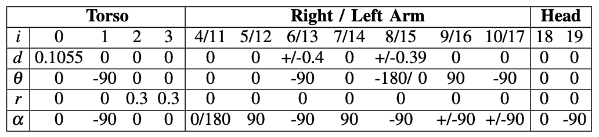

# dlr-elastic-calibration

Dateset used in the paper "Calibration of an Elastic Humanoid Upper Body and Efficient Compensation for Motion Planning“. 

The data contains 500 measurements of the humanoid robot Agile Justin. Each data point consists of the commanded joint configuration and the corresponding positions of the left and the right end-effector. 
The measurements were acquired using an external camera system from Vicon, consisting of six 16Mpx cameras mounted on the ceiling, which tracked the two retro-reflective markers on the robot’s hands. 

---

All positions are provided in the frame of the camera system.
Initial guesses for the base of the robot, seen from the camera system

```python
T_c_0 = [[ 0, -1,  0, -2.5], 
         [+1,  0,  0, +2.0],
         [ 0,  0, +1, +0.1],
         [ 0,  0,  0,    1]]
```

and the marker positions on the right and left arm

```python
p_r_m = [-0.1, -0.03, +0.1]
p_l_m = [-0.1, +0.03, +0.05]
```

All three frames need to be included to close the measurement loop and calibrate the forward kinematic with the provided data.

---

The nominal kinematic of Agile Justin is given by the DH-parameters: 

	(lenghts in meters, angles in degrees)


