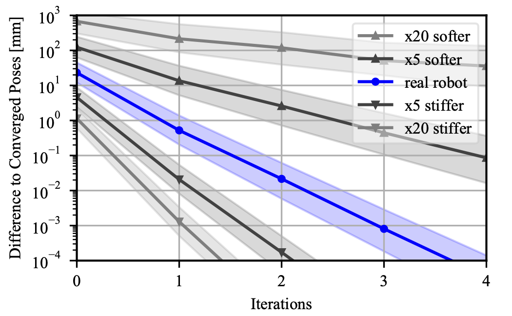
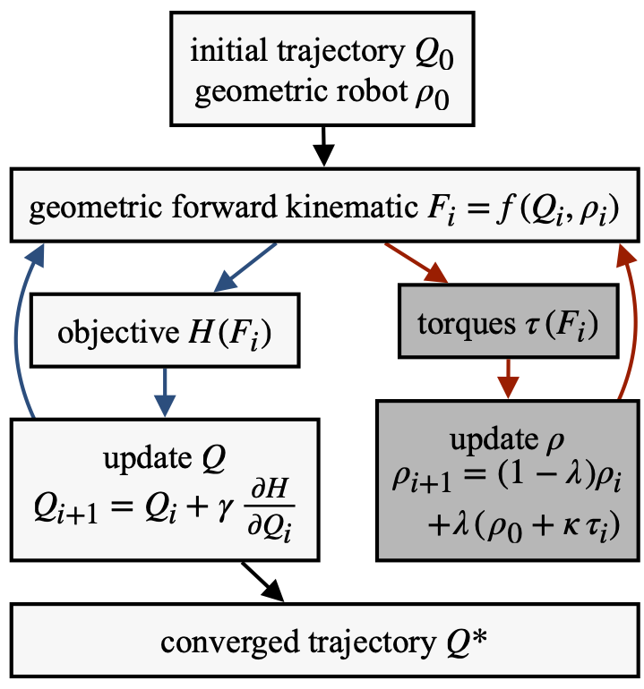

After calibrating the humanoid robot with joint elasticities as well as lateral elasticities we have an implicit robot 
model.
To calculate the position of the body frames we need to solve this model iteratively, which is expensive.
This especially true for motion planning where we have to evaluate the forward kinematic and its derivative repeatedly.
To make those calculations efficient we introduce an algorithm that takes into account that for optimized motion planning we have and outer loop which converges.
This allows us to reduce the number of iterations for the inner torque equilibrium loop. 
For reasonable elasticities those additional can be skipped completely.

---

{:.this 
style="width: 600px; 
display: block;
margin-left: auto;
margin-right: auto"}
*Simulated convergence towards the static torque equilibrium for robots of different stiffness.
For iteration 0 the elastic effect is ignored.
The bands indicate the standard deviation for 1000 different joint configurations.*

---

{:.this 
style="width: 400px; 
display: block;
margin-left: auto;
margin-right: auto"}
*Flowchart of the optimization loop in light gray.
Dark gray shows the additional loop for the static torque equilibrium.
As the outer loop converges, no additional passes through the inner torque loop are necessary.*

