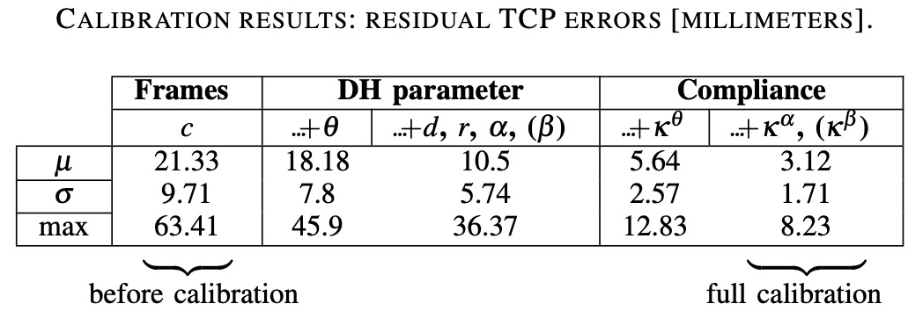
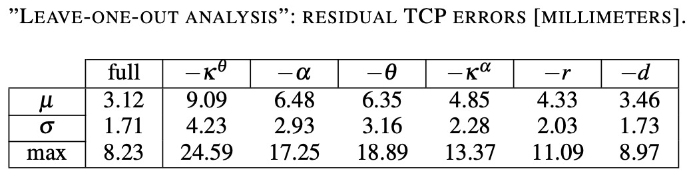

This section gives an overview about our calibration results.
We made an elastic model of the forward kinematic

$$
f = f(q, \rho_0, \kappa, \nu)
$$

with joint angles x\\(q\\),  DH-parameters \\(\rho_0\\), elasticities\\(\kappa\\) ,and masses \\(\nu\\).
We were able to drastically reduce the error by including both the joint elasticities and lateral elasticities.
The effect of the different parameters on the calibration result can be seen in the following tables.

---

{:.this 
style="width: 600px; 
display: block;
margin-left: auto;
margin-right: auto"}
*Histogram of the residual error at the end effectors before and after calibration, highlighting the need for non-geometric modeling of Justin.
 The circles on the \\(x\\)-axis mark the mean \\(\mu\\) of the error.*

---

{:.this 
style="width: 600px; 
display: block;
margin-left: auto;
margin-right: auto"}

---

{:.this 
style="width: 600px; 
display: block;
margin-left: auto;
margin-right: auto"}
