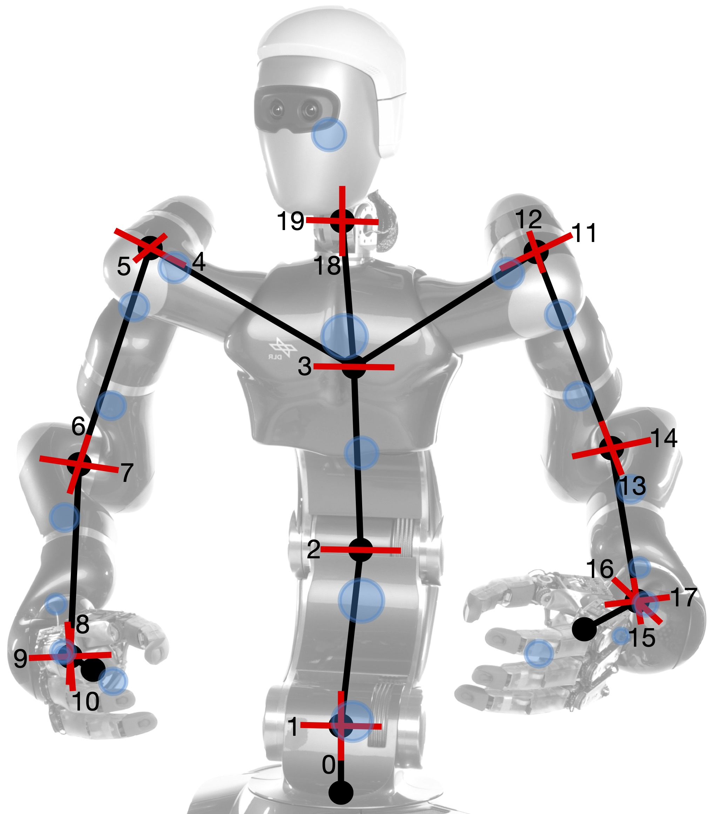
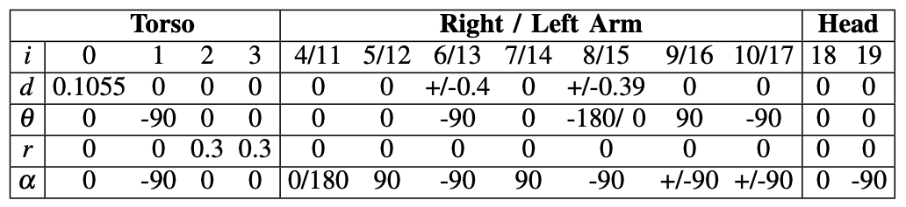

{:.this 
style="width: 500px; 
display: block;
margin-left: auto;
margin-right: auto"}
*Kinematic tree structure of the humanoid Agile Justin, showing its 20 degrees of freedom (red) and the mass model used for calibration (blue).*

Here the DLR's humanoid robot Agile Justin is presented.
The robot has 20 joints in the upper body; 4 in the torso, 7 in each arm and 2 for the head. 
To model the elastic effects we need the masses of each link, we adopted those from CAD files of the robot.

---
The nominal kinematic of Agile Justin is given by the DH-parameters: 

{:.this 
style="width: 600px; 
display: block;
margin-left: auto;
margin-right: auto"}	(lengths in meters, angles in degrees)

