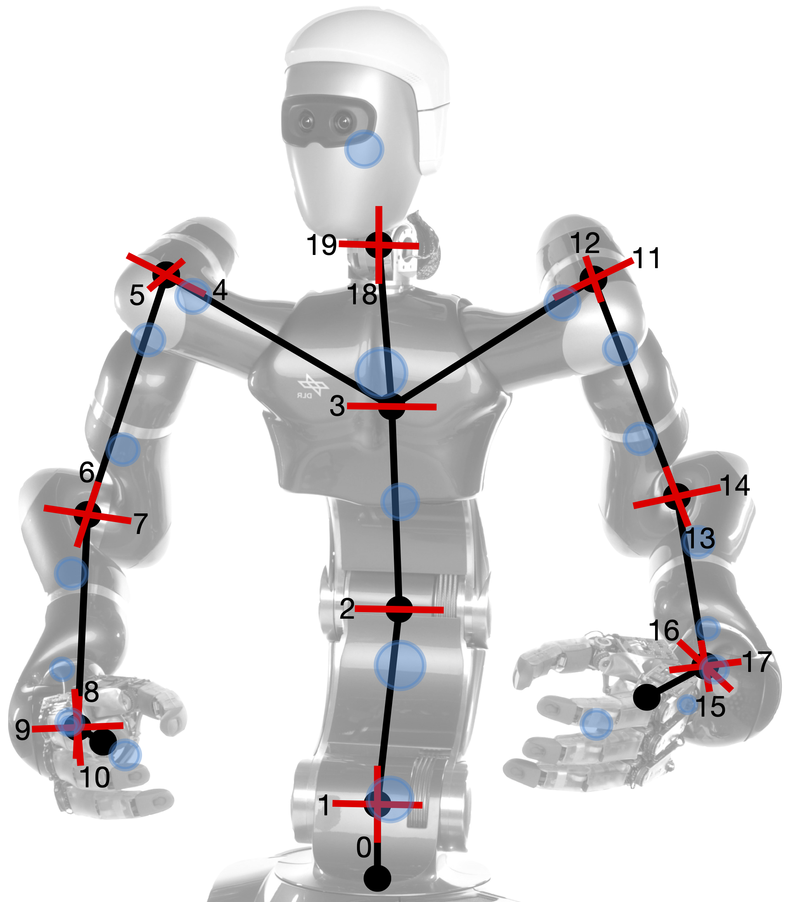

Here the DLR's humanoid robot Agile Justin is presented.
The robot has 20 joints in the upper body; 4 in the torso, 7 in each arm and 2 for the head. 

---

The nominal kinematic of Agile Justin is given by the DH-parameters: 

	(lenghts in meters, angles in degrees)

The masses were adopted from CAD files of the robot.
